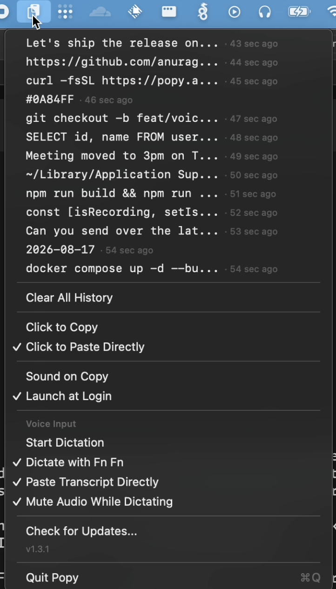

<h1 align="center">
  
  <br>
  Popy
</h1>

<p align="center">
  <strong>Talk instead of typing. Press Fn twice and your words land on the clipboard.</strong>
</p>

<p align="center">
  <a href="https://github.com/anuragxxd/popy/stargazers"></a>
  <a href="https://github.com/anuragxxd/popy/releases"></a>
  <a href="https://github.com/anuragxxd/popy/blob/master/LICENSE"></a>
  
</p>

<p align="center">
  Dictation that runs entirely on your Mac. No API key, no subscription,<br>
  no account, and your voice never leaves the machine.<br>
  Plus the clipboard history you already wanted.
</p>

<p align="center">
  <a href="#install">Install</a> &middot;
  <a href="#voice-input">Voice Input</a> &middot;
  <a href="#what-it-does">Features</a> &middot;
  <a href="#settings">Settings</a> &middot;
  <a href="#contribute">Build from Source</a>
</p>

---

<p align="center">
  
</p>

## Install

One command:

```bash
curl -fsSL https://raw.githubusercontent.com/anuragxxd/popy/master/install.sh | bash
```

Or **[download the DMG manually](https://github.com/anuragxxd/popy/releases/latest)** — open it, drag Popy to Applications, done.

## What it does

- **Dictate anywhere** — press **Fn twice**, speak, press **Fn twice** again
- Transcribes **on-device** in under a second; nothing is uploaded
- Remembers your last 25 text copies
- Click any entry to copy it back (or paste it directly into the active app)
- **Cmd+Shift+V** to open from anywhere, no mouse needed
- Survives restarts — your history is saved
- No dock icon, no windows, no clutter

## Voice input

Press the **Fn (globe) key twice** to start listening. The menu bar icon turns
into a red microphone. Press **Fn twice again** to stop — a second later the
transcript is on your clipboard, ready to paste.

The transcript is stored **exactly as spoken**. Nothing rewrites, summarises,
or "cleans up" your words.

If a recording contains no speech, it is discarded without transcribing —
speech recognisers otherwise hallucinate filler text ("you", "Thank you.")
when handed silence. Detection is based on the audio level, never on
pattern-matching the transcript, so real words are never dropped.

**First run** downloads a 142 MB speech model. After that it works offline.

**One setup step:** macOS binds the Fn key by default. Go to
**System Settings → Keyboard → "Press 🌐 key to"** and choose **Do Nothing**,
otherwise the emoji picker will open every time you dictate.

### Where it runs

Transcription happens entirely on your Mac using
[whisper.cpp](https://github.com/ggml-org/whisper.cpp) (MIT) with OpenAI's
`base.en` model. There is no API key, no subscription, no per-use cost, and
your audio never leaves the machine. Typical latency is well under a second
for a short utterance on Apple silicon.

## Security

Clipboard history is stored in the macOS Keychain (encrypted at rest, app-scoped). No plaintext history is written to UserDefaults.

Voice audio is written to a temporary file, transcribed locally, and deleted
immediately afterwards. No audio is ever transmitted.

## Settings

All toggleable from the menu:

- **Click to Copy** or **Click to Paste Directly** — choose what happens when you click an entry
- **Sound on Copy** — subtle audio feedback
- **Launch at Login** — start Popy automatically
- **Dictate with Fn Fn** — enable or disable voice input
- **Paste Transcript Directly** — auto-paste after dictating instead of clipboard-only
- **Mute Audio While Dictating** — silence system output while recording so it
  doesn't bleed into the microphone (on by default)

> Either "Paste Directly" mode simulates Cmd+V into whatever app you're using,
> so macOS asks for Accessibility permission the first time.
>
> Dictation itself only needs Microphone access — watching for the Fn key
> requires no special permission.

## Requirements

macOS 12 (Monterey) or later.

## Contribute

Issues and PRs welcome at [github.com/anuragxxd/popy](https://github.com/anuragxxd/popy).

To build from source:

```
git clone https://github.com/anuragxxd/popy.git
cd popy
bash create-signing-identity.sh   # once — keeps macOS permissions stable
bash build-whisper.sh             # once — builds the voice engine (~5 min)
bash setup.sh                     # builds Popy.app
```

`setup.sh` alone is enough to get a working build. The other two are one-time
setup and both degrade gracefully: without the engine, voice input is simply
reported as unavailable; without the signing identity, the app falls back to
ad-hoc signing.

**Why the signing step matters.** macOS records permissions against a code
signature, not an app name. With ad-hoc signing that means a *content hash*,
which changes on every rebuild — so Accessibility silently lapses and "paste
directly" stops working, while System Settings still shows Popy as allowed.
Signing with a certificate ties the permission to the certificate instead, so
it survives rebuilds. Run `bash create-signing-identity.sh --remove` to undo.

## License

MIT
